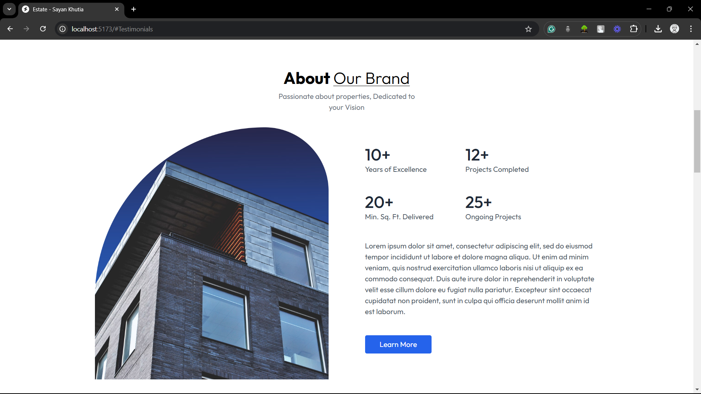
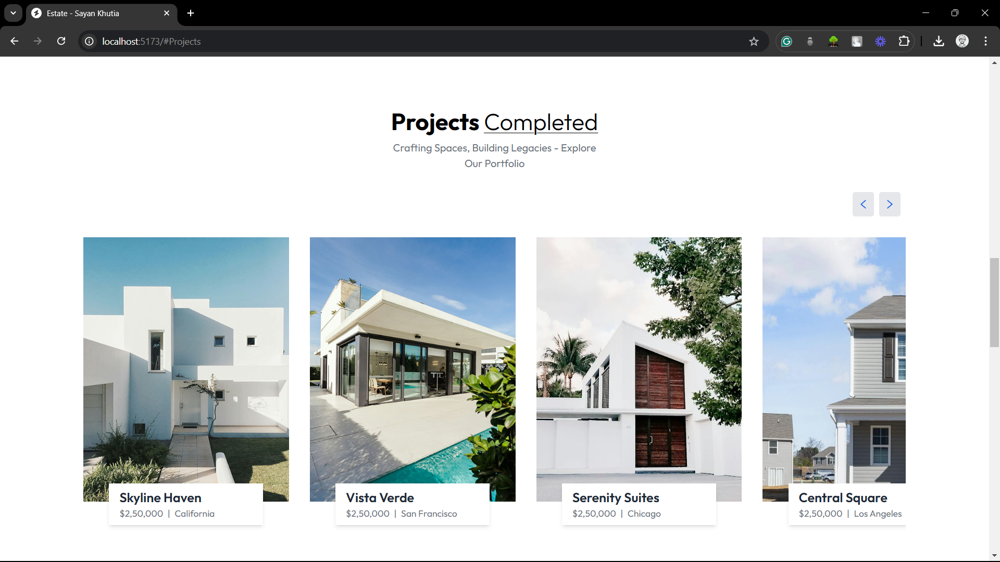
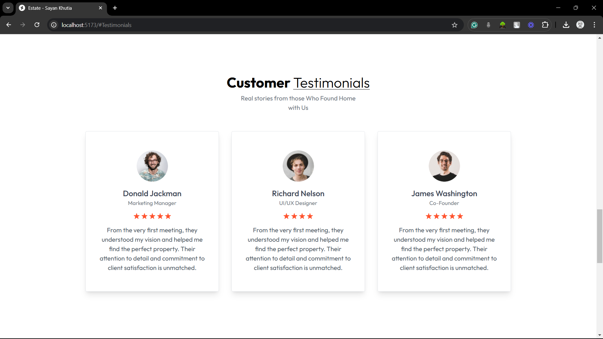
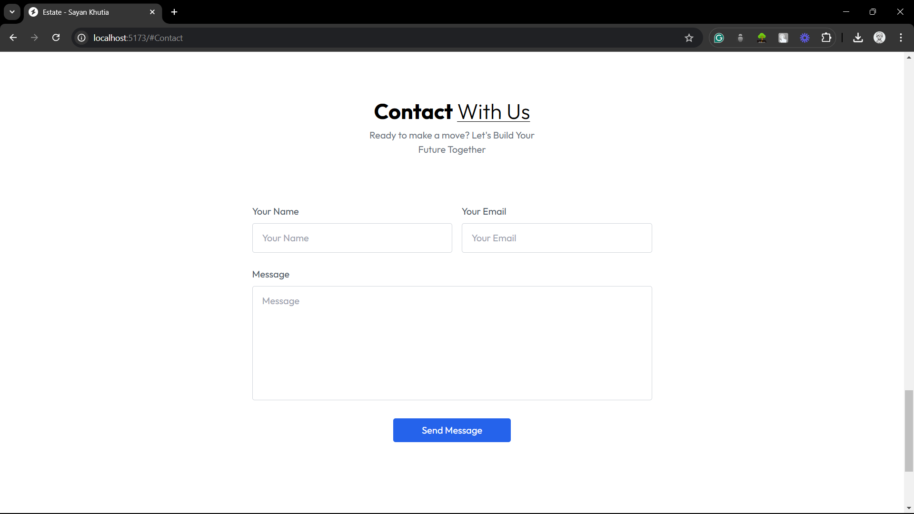

# Modern Real Estate Website

## Overview
A sleek, modern single-page application (SPA) showcasing real estate projects, designed to provide an immersive and interactive user experience. This React-based website offers comprehensive information about real estate developments, client testimonials, and easy contact options.

## Table of Contents
- [Key Features](#key-features)
- [Technologies Used](#technologies-used)
- [Installation](#installation)
- [Usage](#usage)
- [Project Structure](#project-structure)
- [Contributing](#contributing)
- [Contact](#contact)

## Key Features
- **Responsive Design**: Fully responsive layout that looks great on all devices
- **Smooth Animations**: Implemented using Framer Motion for engaging user interactions
- **Notification System**: Toast notifications for user feedback
- **Multiple Sections**:
  - Home: Landing page with overview and highlights
  - About: Company background and mission
  - Projects: Detailed real estate project showcases
  - Testimonial: Client success stories and reviews
  - Contact Us: Easy-to-use contact form with form validation

## Technologies Used
### Frontend
- **React**: JavaScript library for building user interfaces
- **Vite**: Next-generation frontend tooling for fast development
- **React DOM**: React package for working with the DOM

### Key NPM Packages
- `framer-motion`: Powerful animation library
- `react-toastify`: Toast notification system
- `react`: Core React library
- `react-dom`: React package for DOM rendering

## Installation

### Prerequisites
- Node.js (v14.0.0 or later)
- npm (v6.0.0 or later)

### Steps
1. Clone the repository
```bash
git clone https://github.com/i-sayankh/real-estate.git
cd real-estate
```

2. Install dependencies
```bash
npm install
```

3. Run the development server
```bash
npm run dev
```

4. Build for production
```bash
npm run build
```

## Usage
1. Navigate through sections using the main menu
2. Explore project details in the Projects section
3. Read client testimonials
4. Use the Contact form to get in touch

## Project Structure
```
real-estate-website/
│
├── public/
│   └── assets/
│
├── src/
│   ├── components/
│   │   ├── Home/
│   │   ├── About/
│   │   ├── Projects/
│   │   ├── Testimonial/
│   │   └── Contact/
│   │
│   ├── styles/
│   ├── utils/
│   └── App.jsx
│
├── package.json
└── vite.config.js
```

## Contributing
Contributions are welcome! Please follow these steps:
1. Fork the repository
2. Create your feature branch (`git checkout -b feature/AmazingFeature`)
3. Commit your changes (`git commit -m 'Add some AmazingFeature'`)
4. Push to the branch (`git push origin feature/AmazingFeature`)
5. Open a Pull Request

## Screenshots
### Home Page


### Home Page


### Projects Section


### Testimonials Section


### Contact Form


## Contact
- **Project Maintainer**: Sayan Khutia
- **Email**: sayankhutia@gmail.com
- **GitHub**: i-sayankh(https://github.com/i-sayankh)

---